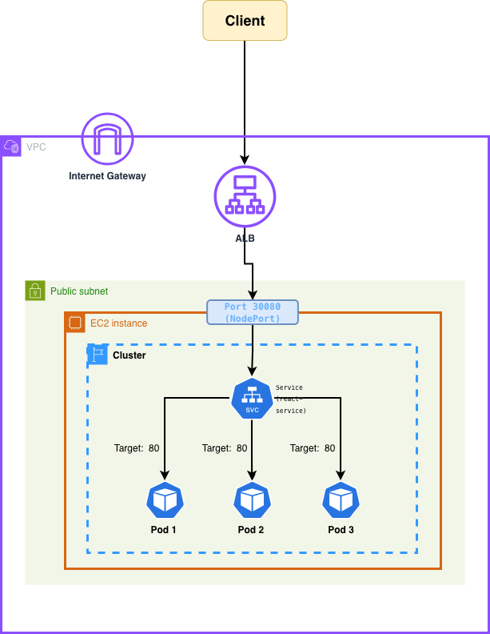
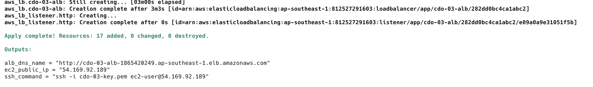
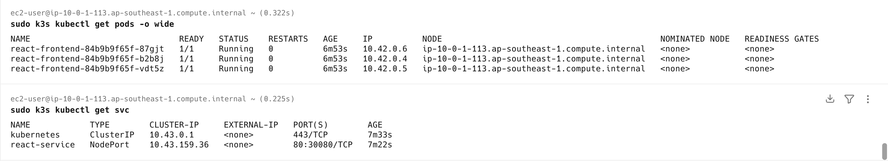
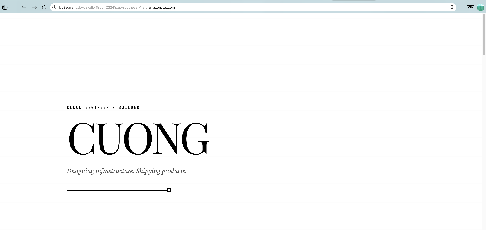
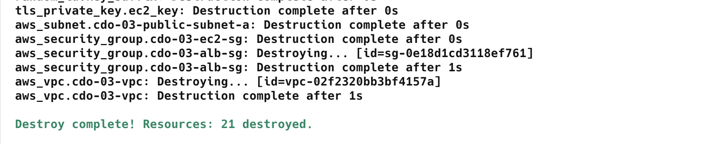

# EVIDENCE REPORT

## Đề Tài: K8s on AWS — Terraform 1-Click Automation

**Trần Mạnh Cường ------------------------------------------------CDO-03**

---

## LỜI MỞ ĐẦU

Báo cáo dưới đây trình bày chi tiết các quyết định thiết kế hạ tầng, cách thức triển khai và các bằng chứng thực nghiệm để chứng minh giải pháp tự động hóa **1-Click Apply** của em đáp ứng hoàn toàn yêu cầu đề bài.

---

## I. SƠ ĐỒ KIẾN TRÚC HỆ THỐNG (ARCHITECTURE DIAGRAM)

Dưới đây là sơ đồ luồng traffic từ người dùng qua ALB và cấu trúc quản lý hạ tầng bằng Terraform do em thiết kế:



---

## II. GIẢI TRÌNH CÁC QUYẾT ĐỊNH THIẾT KẾ (TỰ DO QUYẾT ĐỊNH)

Dưới đây là các quyết định thiết kế và lựa chọn công nghệ của em nhằm tối ưu hóa hệ thống:

1. **App nào, ngôn ngữ gì?**

   - Em sử dụng một ứng dụng **React Frontend (Vite)** đơn giản, được đóng gói gọn nhẹ và lưu trữ trên Docker Hub dưới tên image: `manhcuong139/portfolio:latest`.

2. **Công cụ K8s & Driver nào?**

   - Đề bài yêu cầu sử dụng cụm K8s chạy bằng Minikube hoặc Kind trên EC2. Tuy nhiên, do giới hạn tài nguyên của máy ảo `t3.small` (chỉ có 2 vCPU và 2GB RAM), việc chạy Minikube/Kind thông qua Docker driver sẽ tạo thêm một lớp ảo hóa trung gian cực kỳ tốn RAM (mất khoảng \~1.5GB RAM chỉ để chạy cluster ảo).
   - Vì thế, em quyết định sử dụng **K3s (K3s Server - Bare-metal)**. K3s cực kỳ gọn nhẹ (chỉ tiêu tốn \~512Mi RAM nền) và chạy trực tiếp trên OS của EC2 (Bare-metal, không qua Docker driver), giúp ứng dụng chạy cực kỳ mượt mà, tối ưu hóa tài nguyên phần cứng mà không bị tràn RAM dẫn đến crash EC2.

3. **Provider thứ hai là gì, wire kiểu nào?**

   - **Provider thứ hai:** Provider `kubernetes`.
   - **Cách liên kết (wire kiểu nào):**
     - Đầu tiên, em khai báo file cấu hình giả `dummy_kubeconfig` để Terraform không bị lỗi kiểm tra cú pháp ở bước `plan`.
     - Ở bước `apply`, tham số `host` của provider `kubernetes` được liên kết động với IP Public của EC2 vừa tạo: `host = "https://${aws_instance.cdo-03-instance.public_ip}:6443"`.
     - Đồng thời, em dùng resource `terraform_data.wait_for_k3s` chạy script ping kiểm tra API Server của K3s trên EC2 cho tới khi phản hồi `"pong"`, đảm bảo API Server đã hoàn toàn sẵn sàng rồi mới cho phép provider `kubernetes` triển khai app.

4. **Cách app được đưa vào cụm?**

   - Ứng dụng React được deploy vào cụm K8s thông qua resource `kubernetes_deployment_v1` (với 3 replicas) lấy ảnh từ Docker Hub.
   - Ứng dụng được expose ra ngoài qua `kubernetes_service_v1` với kiểu cổng `NodePort` (cổng cố định `30080` trên máy EC2 host).

5. **Network/VPC: tự dựng hay dùng default?**

   - Em chọn giải pháp **tự dựng hoàn toàn VPC (Custom VPC)** mới thay vì dùng VPC mặc định để kiểm soát an ninh chặt chẽ.
   - VPC tự dựng gồm: **2 Subnets Public** nằm ở 2 Availability Zones (AZs) khác nhau để đáp ứng yêu cầu bắt buộc của AWS Application Load Balancer (ALB).
   - Thiết lập Internet Gateway, Route Tables và Security Groups chỉ cho phép traffic đi từ ALB vào cổng `30080` của EC2.

6. **Cấu trúc thư mục, biến, module?**

   - Toàn bộ code hạ tầng được đặt gọn gàng trong thư mục `/practice`.
   - Tách biệt rõ ràng các file tài nguyên:
     - `providers.tf`: Khai báo aws và kubernetes.
     - `variables.tf`: Quản lý các tham số cấu hình (AMI, region, instance_type, react_image...).
     - `main.tf`: Chứa toàn bộ logic dựng VPC, Security Group, EC2, ALB, K3s wait ping, Deployment và Service K8s.
     - `outputs.tf`: Trả về URL của ALB và lệnh SSH vào EC2 sau khi apply thành công.
     - `secrets.tfvars`: File lưu trữ các thông tin bảo mật (AWS access/secret keys) của deployer.

---

## III. MINH CHỨNG THỰC TẾ NỘP BÀI

### Evidence 1: Lệnh khởi tạo hạ tầng tự động (1-Click Apply)

Em đã chạy lệnh khởi động duy nhất từ thư mục sạch:

```bash
terraform apply -var-file="secrets.tfvars" -auto-approve
```

---

### Evidence 2: Xác nhận các Pod ứng dụng chạy trong cụm K8s (EC2 Host)

Em đã SSH vào EC2 host thông qua lệnh `ssh_command` được cấp ở output và thực hiện kiểm tra trạng thái các Pods và Services trong cụm K3s bằng các câu lệnh:

```bash
sudo k3s kubectl get pods -o wide
sudo k3s kubectl get services -o wide
```

---

### Evidence 3: Truy cập ứng dụng thành công qua URL của AWS ALB

Em truy cập vào địa chỉ DNS của Application Load Balancer để kiểm tra tính năng định tuyến tải từ Internet vào K8s.

---

### Evidence 4: Dọn dẹp tài nguyên (Terraform Destroy)

Sau khi hoàn thành kiểm thử, em đã tiến hành dọn dẹp sạch sẽ tài nguyên trên cloud để tránh phát sinh chi phí bằng lệnh:

```bash
terraform destroy -var-file="secrets.tfvars" -auto-approve
```

---

## IV. ĐÁNH GIÁ

- Qua bài Challenge này, em đã làm chủ được kỹ năng thiết kế hạ tầng mạng phức tạp trên AWS (VPC, ALB, Route Tables, Security Groups).
- Em đã hiểu sâu sắc cơ chế hoạt động của Terraform Dependency Graph và cách đồng bộ hóa trạng thái giữa tài nguyên Cloud vật lý với tài nguyên Kubernetes logic.
- Việc tối ưu hóa loại bỏ Docker ngoài và chạy K3s trực tiếp dạng Bare-metal đã giúp hệ thống tiết kiệm được gần 70% RAM tiêu thụ trên EC2 và rút ngắn thời gian khởi tạo xuống chưa đầy 2 phút.